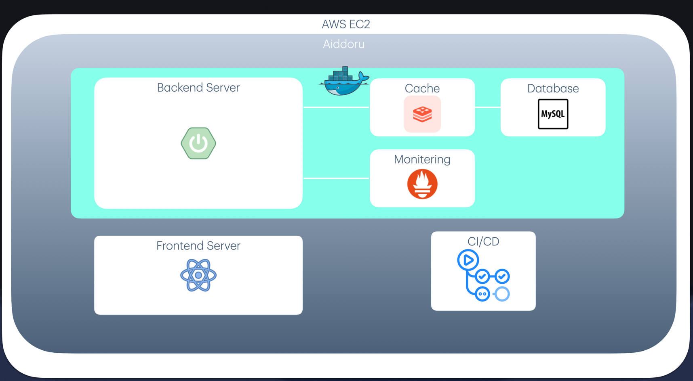

# What is this?
매일 약 5천건의 데이터를 수집하여
크리에이터의 근황을 추적할 수 있게 하는 서비스입니다.

# 기능
- 최근 구독자 상승세 및 통계
- 최근 영상 제공
- 태그를 기반으로한 추천 제공

# changelog
ver 1.0
- 유튜버 상승세 및 통계 기능
- 커뮤니티 기능

ver 1.1
- 통계 상세표시 기능 추가
- 한국 유튜버 위주로 최근 영상 저장하도록 개선
- 상승세를 차트로 한눈에 볼 수 있도록 개선

ver 1.2(진행중)
- 구글 트렌드와 유사한 최근 영상들의 트렌드 현황 제공

# 아키텍쳐

# 기술적 쟁점
## 한정된 API 할당량으로 신뢰성 있는 통계를 제공하기
### 목표 
- 매일매일 구독자수, 최근 영상 등 크리에이터들의 최신 정보를 갱신
### 문제점
- 모든 대상을 대상으로 갱신하기에는 api 할당량 부족
### 해결
- Spring Scheduling 도입
- 4일마다 로테이션으로 페이징하여 갱신
## 사용자와 상호작용하는 추천 기능 효율적으로 제공하기
### 목표 
- 사용자가 크리에이터를 클릭할때마다 추천 태그가 업데이트 되며 동적으로 추천
### 문제점
- 위 기능을 기존 아키텍쳐에서 구현시 매우 느린 성능 예상됨
### 해결
- 모든 데이터를 일정시간만 사용해도 된다 판단
- redis를 도입하고 expireAt을 이용해 사용되는 데이터풀 자체를 줄이기
- 인메모리 db라는 점에서 자체 성능자체도 빠를것이라 예상

## 지속적으로 데이터 수집하며 모니터링하기
### 목표
- 매일매일 데이터를 수집하는 만큼 서버나 cpu에 문제가 생길 가능성을 사전에 파악
### 해결
- prometheus를 이용한 라이브러리인 EazyMonitoering을 개발 주기적으로 서버 모니터링을 하며
문제가 생길시 config에서 설정한 메일로 알람을 가도록 구현함

  
## 항상 바뀌지 않는 데이터를 빠르게 제공하기
### 목표 
- 해당 웹사이트의 특성상 하루에 한번씩만 크리에이터 정보 갱신이 발생함
- 이에 반해 해당 정보 요청은 항상 일어나기 때문에 비효율적이라 판단

### 해결
- redis를 이용해 하루에 한번씩 갱신이 발생한 뒤 정보를 캐싱하여 서버 부하를 줄임

